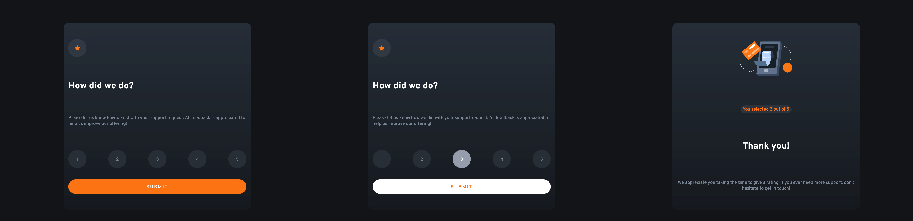

# Frontend Mentor - Interactive rating component solution

This is a solution to the [Interactive rating component component challenge on Frontend Mentor](https://github.com/keijop/frontend-mentor-interactive-rating). Frontend Mentor challenges help you improve your coding skills by building realistic projects.

## Table of contents

- [The challenge](#the-challenge)
- [Screenshot](#screenshot)
- [Links](#links)

- [Built with](#built-with)

### The challenge

Solution should be as identical as possible to the desktop and mobile design.

Users should be able to:

- View the optimal layout depending on their device's screen size
- See hover states for interactive elements

### Screenshot

### Links

[Live URL](https://soft-strudel-5eed7c.netlify.app/)

### Built with

- Semantic HTML5 markup
- Styled Components
- React
- Vite
